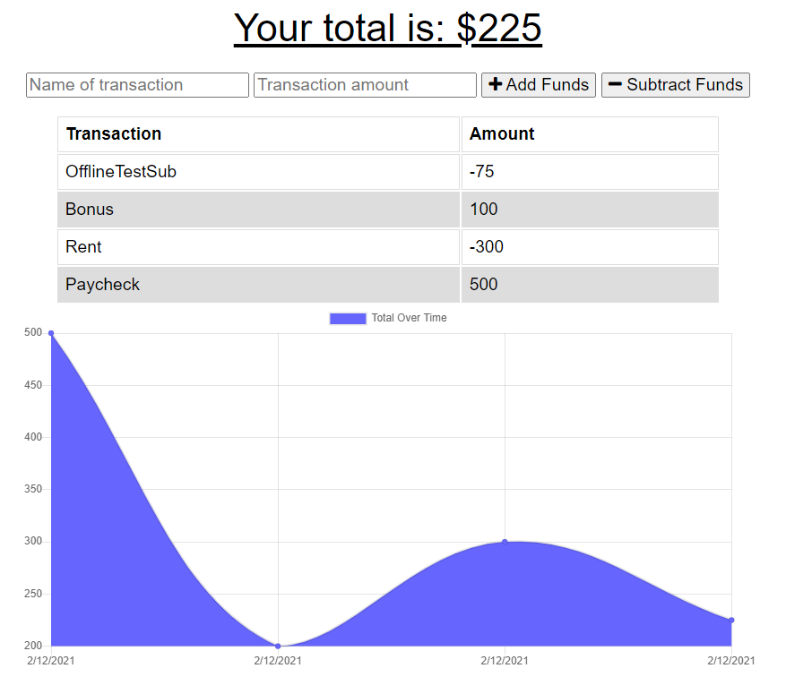

# Online-Offline Budget Tracker
## Description
Simple budget tracker interface utilizing PWA manifest, service worker, and indexedDB storage for a complete offline experience.  
## Table of Contents
- [Installation](#installation)
- [Usage](#usage)
- [Contributing](#contributing)
- [Tests](#tests)
- [License](#license)
- [Questions](#questions)
- [Screenshot](#screenshot)
- [Application](#application)
## Installation
npm i
## Usage
node server.js
## Contributing
None
## Tests
None
## License
The_Unlicense

For information on this license, please follow [this link](https://choosealicense.com/licenses/unlicense/)
## Questions
Contact the author with questions via GitHub or email at

[JonPointer at GitHub](https://github.com/JonPointer) jonpointer@msn.com
## Screenshot

## Application
[Deployed Application on Heroku](https://budget-tracker-jsp.herokuapp.com/)